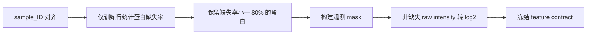

# GOAI 虚拟细胞文档基线复现：解读文件计划

## 1. 文档定位

最终解读文件拟命名为 `docs/baseline_method.md`。它不是参赛宣传稿，也不是直接照搬 PDF，而是一份与代码逐项对应、能让队友独立复现和审查的技术说明。

文档统一回答四个问题：

1. 任务到底预测什么，为什么是高维 OOD 条件响应问题。
2. 文档 Baseline 的每一步在做什么，为什么按这个顺序做。
3. 我们如何保证训练、验证、test 推理之间没有标签泄漏。
4. 完整复现后，哪些缺陷需要修正，创新应按什么顺序推进。

首版只陈述已经由代码或数据核验的事实。尚未运行的实验不写成“已经验证”，PDF 的诊断数值必须标为“文档发布的对标结果”。

## 2. 章节结构

### 2.1 复现范围与原则

说明本阶段只复现：蛋白均值、Matched Control、条件编码 MLP、P1-P4 特征阶梯。明确列出未进入基线的第五章模块，并解释“方法复现”和“错误代码照抄”的区别。

本节附一张范围表：模块、是否复现、进入阶段、原因。

### 2.2 任务与真实数据

内容包括：

- 输入是菌株、化合物、培养基、温度和处理时间。
- 输出是经过训练缺失过滤后的 log2 蛋白质组向量。
- 任务不以 control 蛋白向量作为模型输入，本质是从条件直接生成响应。
- 四个冻结验证场景分别代表新化合物、新菌株、双重未知和时间泛化。
- 真实字段、样本数、蛋白数、缺失率和实体覆盖。

本节使用两张表：数据规模表、字段分类表。字段分类表必须把生物条件、测量上下文、划分标签分开，避免把 `split_final` 等泄漏字段误当特征。

### 2.3 数据预处理原理

按实际执行顺序解释：

重点解释：

- 为什么不能按行顺序拼表。
- 为什么缺失过滤只能用训练行。
- 为什么 `NaN` 不是 0。
- 为什么 loss 中可以临时填 0，但必须由 mask 屏蔽。
- 为什么提交必须还原或直接保持 log2 生物尺度。

### 2.4 基线一：蛋白均值

给出数学定义、训练数据依赖、预测形式和它能检查的流水线问题。说明其优点是稳定、无训练，缺点是完全忽略条件，因此逐蛋白差异预测能力很弱。

附一段与 `b0_mean` 代码路径和产物的对应说明。

### 2.5 基线二：Exact Matched Control

用表格完整列出八个真实匹配键，解释 Water/DMSO 对照、多对照取非缺失均值、有效 matched subset 的形成方式。

必须强调：

- 它衡量“假设处理没有额外效应”时能达到多强。
- 它是本地验证诊断和训练 delta 先验的工具。
- 没有 test control 真值时不能拿它直接生成隐藏 test 预测。
- 使用验证 control 标签做诊断不等于允许其进入 MLP 训练。

本节引用 PDF 的诊断表时，标注为文档对标值；本地复现结果另起表格，禁止混写。

### 2.6 基线三：条件编码 MLP

使用一张结构图解释：

正文解释共享隐层为何适合高维多输出、未知类别为什么会成为全零 one-hot，以及这个限制为什么让 P1-P4 特征成为必要的基线扩展。

同时给出 mask-aware MSE 公式，并说明分母是当前参与计算的有效观测总数。

### 2.7 P1-P4 特征阶梯

使用一张累积消融表：

| 阶段 | 新增内容 | 解决的问题 | 主要风险 |
|---|---|---|---|
| P0 | 五类条件 one-hot | 建立可训练主模型 | 新实体全零 |
| P1 | 菌株均值、化合物 delta 先验 | 注入训练响应统计 | 新实体 fallback、target encoding 偏乐观 |
| P2 | 菌株×培养基、化合物×温度 | 显式条件交互 | 组合稀疏 |
| P3 | 时间 sin/cos | 表达时间连续性 | 周期假设不一定符合动力学 |
| P4 | 32 维名称 hash | 区分未知化合物名称 | 无化学语义 |

每个阶段都写清特征如何拟合、未知实体如何处理、为什么只能用训练目标统计，以及它对应的实验 ID。

### 2.8 训练与验证流程

说明固定 50 epoch、Adam、`1e-3`、seed 42 和不做超参数搜索的原因：首轮目标是建立统一复现参照，而不是在验证集上反复调参。

验证部分必须按四场景分别报告，并区分：

- 全验证集模型结果。
- exact matched subset 上与 Control 的同样本比较。

解释 log2 RMSE、Global R2 和逐蛋白 R2 中位数分别看什么，尤其说明高 Global R2 不代表学到了扰动差异。

### 2.9 实验结果与消融记录

代码运行后填入两类真实结果表：

1. B0、B1、P0-P4 x 四验证场景的主表。
2. 每增加一组特征相对上一步的变化表。

不只列数字，还要逐步回答：

- P0 是否超过均值基线。
- P0-P4 是否在 exact subset 上超过 Matched Control。
- P1 的提升是否只发生在已见实体。
- P2 是否改善组合泛化。
- P3 是否主要改善 `val_time`。
- P4 是否对新化合物有稳定收益，还是只有随机区分作用。

若实验失败，原样记录，不为让故事完整而隐藏负结果。

### 2.10 PDF 与真实数据的复现勘误

单独列出并解释：

- PDF 字段名与真实字段名的映射。
- 时间示例为小时、真实数据为分钟。
- `<80%` 训练缺失规则实际保留 4,422，而不是 4,232。
- `np.concat` 应为 `np.concatenate`。
- 32 维 MD5 示例越界及我们的兼容实现。
- `product_id` 不存在，control/QC 由真实扰动名称识别。
- Matched Control 不能在缺少 test 蛋白真值时充当提交模型。

勘误表至少包括“文档写法、真实情况、修正、是否改变方法意图”四列。

### 2.11 公平性与可复现性

记录允许的数据文件、训练统计边界、Git 忽略策略、运行 manifest 和提交校验。明确项目没有使用任何 test 蛋白真值或其衍生信息。

本节给出从数据审计到提交验证的命令，确保队友能够按 README 重跑。

### 2.12 复现完成后的修正与创新路线

这一节只提出后续实验，不把它们包装成当前 Baseline。按由低风险到高风险递进：

1. **先修正验证与统计先验**：P1 改为 OOF/leave-one-group-out 统计，排除训练侧 target encoding 偏乐观；核对官方评分公式。
2. **再改预测目标**：以 matched/control 或上下文均值为锚点预测扰动 delta，比较端到端绝对丰度与残差预测。
3. **再解决实体零样本**：化合物名称 hash 升级为 SMILES/分子描述符，菌株 one-hot 升级为基因组/变异表征，优先观察 `val_both`。
4. **再建模观测过程**：把仪器和板号放入独立批次分支或校准模块，不与生物实体混用。
5. **再利用输出结构**：加入蛋白共表达、GO/KEGG/PPI 或蛋白 embedding，研究高维输出的共享结构。
6. **最后调 loss 与集成**：在基线和残差模型都稳定后再尝试 fold-change/PCC loss、正则、后处理和多种子集成。

每一级创新都要以完整 Baseline 为对照，只允许一次改变一个核心因素，并预先指定主要验证场景、指标、失败回退和消融方式。文献调研也按这六级问题组织，避免先找一个热门模型再反向套题。

## 3. 图表清单

最终解读至少包含：

1. 端到端预处理流程图。
2. MLP 结构图。
3. 数据规模与冻结划分表。
4. 字段分类与防泄漏表。
5. Matched Control 匹配键表。
6. P0-P4 累积特征表。
7. PDF 对标结果与本地复现结果的分离表。
8. 四场景实验主表与逐步消融表。
9. PDF 勘误表。
10. 后续创新递进路线图。

## 4. 写作与证据规则

- 使用“我们”的工程记录口吻，不使用未验证的效果断言。
- 数据数字来自实际脚本输出；PDF 数字带来源标签。
- 每个算法模块都链接到对应代码、配置或 run manifest。
- 结果表必须保留 seed、蛋白集合、样本子集和指标口径。
- 所有未来创新使用“待验证”表述，并写明基线、变量和判定标准。
- 文档中不出现任何 test target 统计、历史测试标签信息或由其衍生的结论。

## 5. 文档完成定义

只有在 B0、B1、P0-P4 全部跑完后，才把本地实验结果写入最终解读。完成版应使一名未参与开发的队友能够：理解每一步原理、复现每个实验、解释 PDF 与真实数据的差异、判断当前 Baseline 的不足，并按既定顺序开始下一阶段创新。
