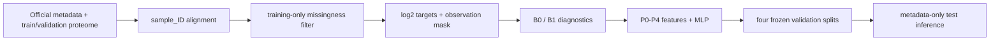

# GOAI Virtual Cell Baseline

[中文 README](README.md) | [Method note](docs/baseline_method.md) | [Document-to-data errata](docs/reproduction_errata.md)

This repository is a reproducible implementation of the document baseline for the GOAI AI for Research virtual-cell track. The task is to predict a yeast perturbation-response vector of `log2` protein intensities directly from strain, perturbation, and experimental conditions, without providing a treatment or control protein profile as model input.

The purpose is to establish an auditable engineering reference before adding advanced methods. Residual decomposition, molecular and genome embeddings, batch calibration, protein priors, multi-objective losses, and ensembling are deliberately out of scope until they can be compared against this baseline.

## 1. Baseline design

The document specifies an incremental ladder: validate the data and metrics first, then add one feature group at a time.



| Experiment | Method | Question answered |
|---|---|---|
| `b0_mean` | Non-missing training `log2` mean for every protein | Are alignment, filtering, scale, masks, metrics, and submission formatting correct? |
| `b1_matched_control` | Mean Water/DMSO profile under the same biological and measurement context | How strong is the no-extra-treatment-effect comparator? |
| `p0_onehot` | Five one-hot condition groups -> two-hidden-layer MLP | Does the smallest trainable condition-response model work end to end? |
| `p1_priors` | P0 plus strain means and chemical mean deltas | Do training-only response priors help? |
| `p2_crosses` | P1 plus strain×medium and chemical×temperature crosses | Do explicit condition interactions help? |
| `p3_time` | P2 plus time sin/cos | Does continuous time encoding help? |
| `p4_hash` | P3 plus a 32-dimensional chemical-name hash | Can an unseen chemical name be distinguished without external structure data? |

P0-P4 are cumulative ablations. The first reproduction does not tune hyperparameters, so the added feature group is the meaningful experimental change.

## 2. Data contract and preprocessing

Only these official local files are read. By default they belong at the repository root; their paths are configurable in `configs/baseline.yaml`.

| File | Purpose | Target values? |
|---|---|---|
| `WAYB_WAYC_metadata_train_val.csv` | train/validation conditions and frozen split labels | No |
| `WAYB_WAYC_proteome_raw_train_val.csv` | train/validation raw protein intensities | Yes |
| `WAYB_WAYC_metadata_test.csv` | inference conditions, sample IDs, submission order | No |

Preprocessing rules are fixed:

1. Join metadata and proteome rows by `sample_ID`, never file position.
2. Compute protein missingness only on `split_final == "train"`; retain proteins with a rate strictly below `0.80`.
3. Apply `log2` only to observed positive raw intensities. Missing is not zero.
4. Build an observation mask. Missing targets may be filled with zero for tensor storage, but their mask is zero, so they contribute neither error nor gradient.
5. Write `feature_contract.json` for every run to freeze protein names/order, threshold, training count, observed fraction, and output scale.

With the released files, this rule retains **4,422 proteins**. The count is derived, never hard-coded.

The released field names are `Strains`, `perturbation_no_concentration`, `Medium`, `Temperature`, `pert_time`, `pert_time_unit`, and `Yeast_cell_plate`. Bare `pert_id` is not globally unique and is not used as the chemical entity.

## 3. Models and features

### B0: protein mean

Compute each retained protein's non-missing training `log2` mean and repeat the vector for every condition. B0 does not model biology; it is a fast correctness check for the complete data and submission pipeline.

### B1: Exact Matched Control

For each treatment row, use Water/DMSO controls with exact agreement on:

`data_source`, `instrument`, `Yeast_cell_plate`, `Strains`, `Medium`, `Temperature`, `pert_time`, and `pert_time_unit`.

Multiple controls are averaged per protein. A metric position is used only if both the treatment and matched control protein are observed. B1 is a local validation diagnostic and the source of P1 training deltas; it cannot generate hidden-test predictions because no test control protein truth is available.

### P0: condition MLP

P0 concatenates train-fitted one-hot blocks for strain, chemical, medium, temperature, and time. The fixed document architecture is:

```text
input
  -> Linear(input_dim, 256) -> ReLU -> Dropout(0.1)
  -> Linear(256, 256)       -> ReLU -> Dropout(0.1)
  -> Linear(256, n_proteins)
```

It uses full-batch mask-aware MSE, Adam at `1e-3`, 50 epochs, seed 42, no scheduler, and no early stopping. Unseen validation/test categories become all-zero one-hot blocks, which is an intentional P0 limitation.

### P1-P4 feature ladder

| Stage | Added features | Fallback for unseen entities |
|---|---|---|
| P1 | strain-level training protein means; chemical-level training treatment-minus-control mean deltas | global training protein mean or global training delta |
| P2 | strain×medium and chemical×temperature one-hot crosses | all-zero cross block |
| P3 | `sin(2πt/Tmax)` and `cos(2πt/Tmax)` | direct transform using training `Tmax` |
| P4 | deterministic 32-dimensional perturbation-name hash | deterministic vector for every name, without chemical semantics |

P1 target statistics are fit on training rows only. The document reproduction uses full training aggregates; out-of-fold target encoding is intentionally deferred to a later correction experiment.

## 4. Evaluation

Every model is reported separately on:

| Split | Generalization question |
|---|---|
| `val_chem_only` | unseen chemical |
| `val_strain_only` | unseen strain |
| `val_both` | unseen strain and chemical together |
| `val_time` | time extrapolation |

Reported metrics are log2 RMSE, Global R2, and median per-protein R2. Global R2 alone is insufficient because absolute abundance profiles can be highly similar. Always compare MLP variants with B1 on the exact-control-available subset and inspect per-protein R2.

Local run artifacts are not committed. Inspect `runs/<run_id>/metrics.csv`, `protein_r2.csv`, and `metrics.json` using the same feature contract and sample subset for any comparison.

## 5. Installation and commands

```powershell
git clone https://github.com/Chemit797/Go-AI_AIVC.git
Set-Location Go-AI_AIVC
python -m pip install --no-deps --no-build-isolation -e ".[dev]"
```

Python 3.10+, numpy, pandas, PyYAML, PyTorch, and pytest are required. In a fresh environment, use `python -m pip install -e ".[dev]"` to resolve dependencies.

Audit, preprocess, and run the two non-training baselines:

```powershell
python -m goai_baseline.audit --config configs/baseline.yaml
python -m goai_baseline.preprocess --config configs/baseline.yaml --output runs/preprocess/feature_contract.json
python -m goai_baseline.evaluate --config configs/baseline.yaml --variant b0_mean --output-dir runs/b0_mean
python -m goai_baseline.evaluate --config configs/baseline.yaml --variant b1_matched_control --output-dir runs/b1_matched_control
```

Train the feature ladder:

```powershell
python -m goai_baseline.train --config configs/baseline.yaml --variant p0_onehot
python -m goai_baseline.train --config configs/baseline.yaml --variant p1_priors
python -m goai_baseline.train --config configs/baseline.yaml --variant p2_crosses
python -m goai_baseline.train --config configs/baseline.yaml --variant p3_time
python -m goai_baseline.train --config configs/baseline.yaml --variant p4_hash
```

Or execute the complete ladder:

```powershell
.\scripts\run_baseline_ladder.ps1 -IncludeP1ToP4
```

Each MLP run writes a checkpoint, loss history, split metrics, protein-level R2, feature contract, feature summary, and environment/input manifest under `runs/`.

Generate and validate a metadata-only prediction:

```powershell
python -m goai_baseline.predict --config configs/baseline.yaml --run-dir runs\p4_hash-YYYYMMDD-HHMMSS
python -m goai_baseline.submission runs\p4_hash-YYYYMMDD-HHMMSS\prediction.csv --config configs/baseline.yaml --feature-contract runs\p4_hash-YYYYMMDD-HHMMSS\feature_contract.json
```

The contract checker requires official sample order, frozen protein order, unique IDs, no extra index column, finite values, and `log2` scale.

## 6. Fairness and reproducibility

- Only declared train/validation targets and the metadata-only test file are accepted.
- Every target-derived statistic is fit on training rows only.
- Git ignores competition CSVs, checkpoints, predictions, runs, reference PDFs, and temporary files.
- `pytest` covers alignment, train-only filtering, control keys, masked loss, unseen-entity fallback, missing control values, and a tiny end-to-end P0 train-to-submission cycle.

```powershell
pytest
```

## 7. What comes next

After this reference baseline is stable, advance one independently ablated change at a time: OOF priors -> control/delta residual targets -> transferable chemical and strain representations -> a separate batch branch -> protein structure priors -> multi-objective losses and calibration.
