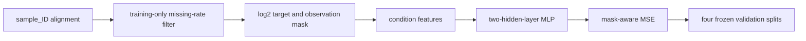

# Baseline Method

## Scope

This code reproduces the document baseline as a ladder: protein mean, Exact Matched Control diagnosis, a condition-encoded MLP, and cumulative P1-P4 feature additions. It intentionally excludes later-stage residual architectures, external entity embeddings, batch calibration, protein priors, multi-loss training, and ensembles.

## Data flow



The input conditions are strain, perturbation name, medium, temperature, and perturbation time. `split_final`, entity-role columns, and measurement-context columns never enter the first MLP. Measurement fields are used only to construct the Exact Matched Control comparator.

## Preprocessing contract

Metadata and protein rows are joined by `sample_ID`, never by position. Protein retention is determined from `split_final == "train"` only: retain a protein when its training missing rate is strictly below 0.80. Observed raw intensities must be positive and are transformed with `log2`; missing values remain missing in the target matrix.

For loss computation a missing value may be temporarily represented by zero, but its mask is zero, so it contributes neither error nor gradient:

```text
loss = sum((prediction - filled_target)^2 * mask) / sum(mask)
```

The generated `feature_contract.json` freezes protein names and order, training size, threshold, observed fraction, and target scale for every run.

## Baselines

### Protein mean

For each retained protein, calculate the non-missing training `log2` mean and repeat that vector for each prediction row. This is a pipeline check and a lower bound; it ignores all conditions.

### Exact Matched Control

For a treatment sample, controls are selected only when all of these fields agree:

| Field | Role |
|---|---|
| `data_source` | acquisition source |
| `instrument` | instrument context |
| `Yeast_cell_plate` | experiment plate |
| `Strains` | genetic background |
| `Medium` | growth context |
| `Temperature` | growth context |
| `pert_time` | perturbation duration |
| `pert_time_unit` | duration unit |

Water and DMSO are controls. Multiple matching controls are averaged per protein. The metric is restricted to the treatment rows with an exact matched control; it is therefore a local diagnostic comparator rather than a submission model.

### Condition MLP

P0 concatenates train-fitted one-hot vectors for strain, perturbation, medium, temperature, and time. The document configuration is fixed: `Linear -> ReLU -> Dropout(0.1) -> Linear -> ReLU -> Dropout(0.1) -> Linear`, hidden width 256, Adam at `1e-3`, full-batch training for 50 epochs, seed 42, and mask-aware MSE.

Unknown validation or test categories have zero one-hot vectors; this is intentional in the strict P0 reproduction.

## Feature ladder

| Variant | New feature group | Fallback for unseen entity |
|---|---|---|
| P0 | five condition one-hot groups | all-zero category block |
| P1 | training strain mean and treatment-control chemical delta means | global training protein mean or global training delta |
| P2 | strain×medium and chemical×temperature one-hot crosses | all-zero cross block |
| P3 | time sin/cos using maximum training time | direct transformation of known time |
| P4 | deterministic 32-dimensional perturbation-name hash | deterministic value for any name |

P1 statistics are calculated from training rows only. The first reproduction follows the document by using complete training aggregates. An out-of-fold version is a subsequent correction experiment, not part of this reference baseline.

## Evaluation

Every baseline reports log2 RMSE, Global R2, and median per-protein R2 on each frozen split: `val_chem_only`, `val_strain_only`, `val_both`, and `val_time`. MLP reports contain all rows and the exact-control-available subset. This prevents a large split from hiding a failure on double-unknown generalization.

## Test prediction

Submission prediction consumes the saved model, saved training feature state, and official submission metadata. It writes log2 predictions in metadata sample order. The final contract check requires the frozen protein order, finite values, unique `sample_ID`, and an exact metadata order match.
